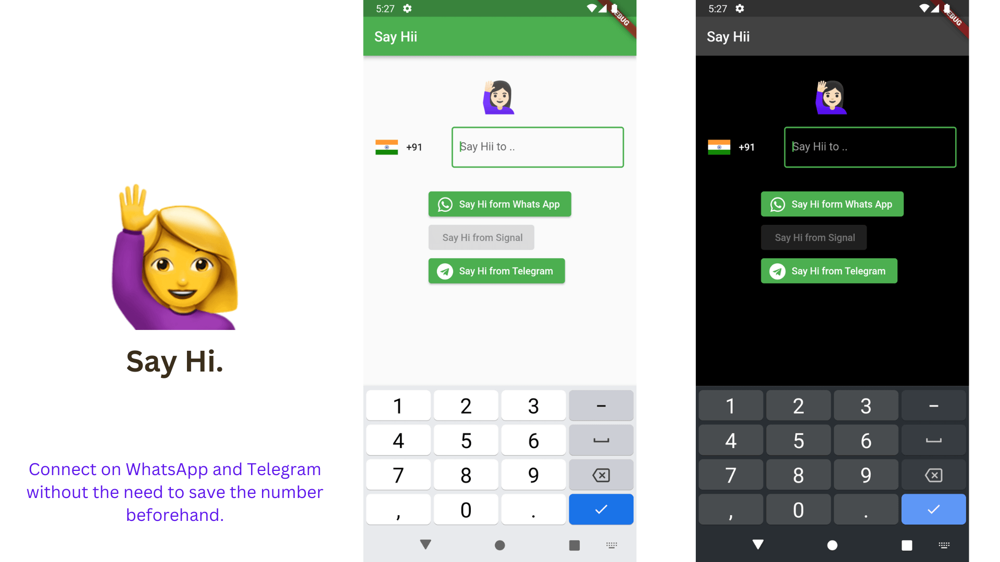

# Say Hi

Say Hi is an open source mobile application built with Flutter that allows users to connect on WhatsApp and Telegram without the need to save the number beforehand.

## Features

- Connect on WhatsApp and Telegram without saving the number
- Dark and light mode support
- Simple and easy-to-use interface

## Screenshots

## Getting Started

To get started with Say Hi, follow these steps:

1. Clone this repository.
2. Run `flutter packages get` to install the required dependencies.
3. Run the app using `flutter run`.

## Contributing

If you'd like to contribute to Say Hi, please fork the repository and make changes as you'd like. Pull requests are welcome!

## License

Say Hi is licensed under the [MIT License](LICENSE).
